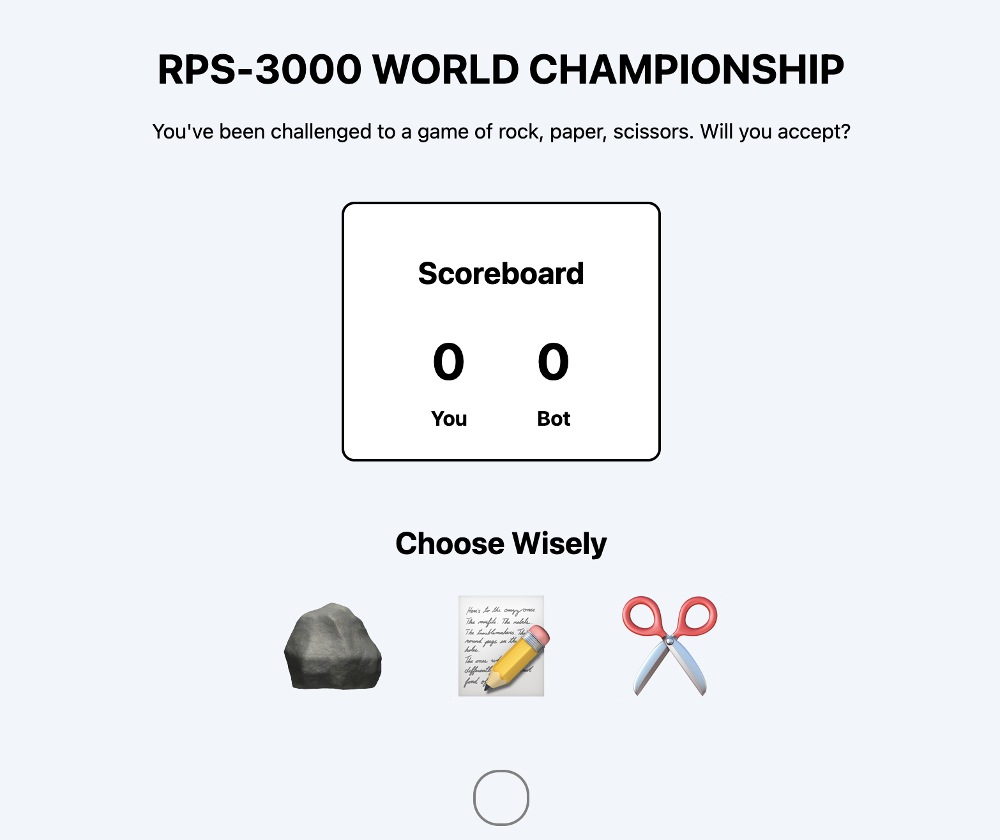

# ✊ Rock Paper Scissors

A simple Rock Paper Scissors game built with JavaScript. Choose your move, play against the computer, and see who wins.

## 📸 Preview

## Features

- Choose rock, paper, or scissors
- Generate a random computer choice
- Compare both choices
- Display the winner

## Built With

- HTML
- CSS
- JavaScript

## What I Practiced

- Conditional logic
- JavaScript functions
- `Math.random()`
- Event listeners
- DOM manipulation